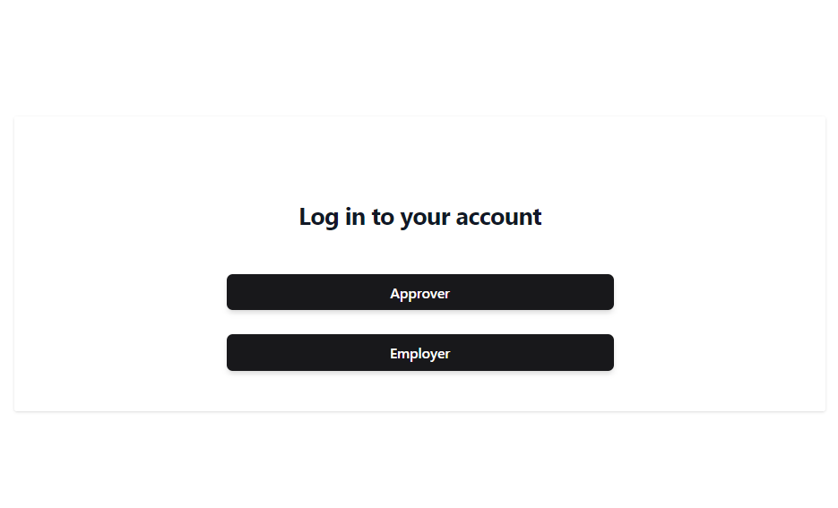
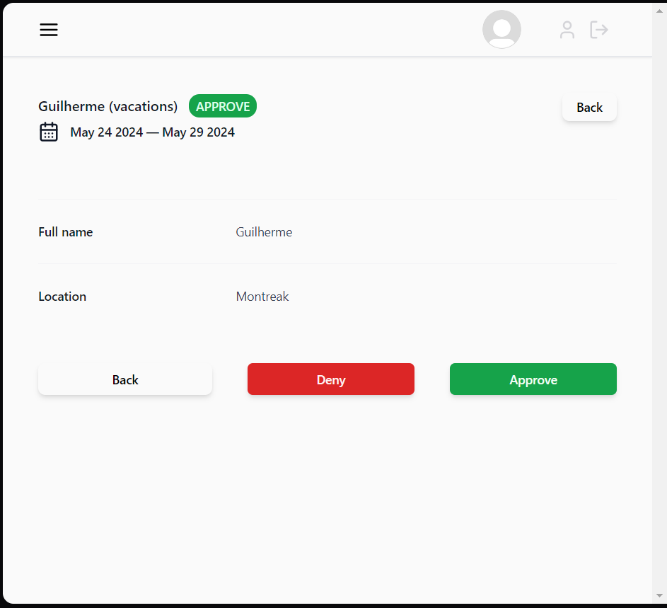
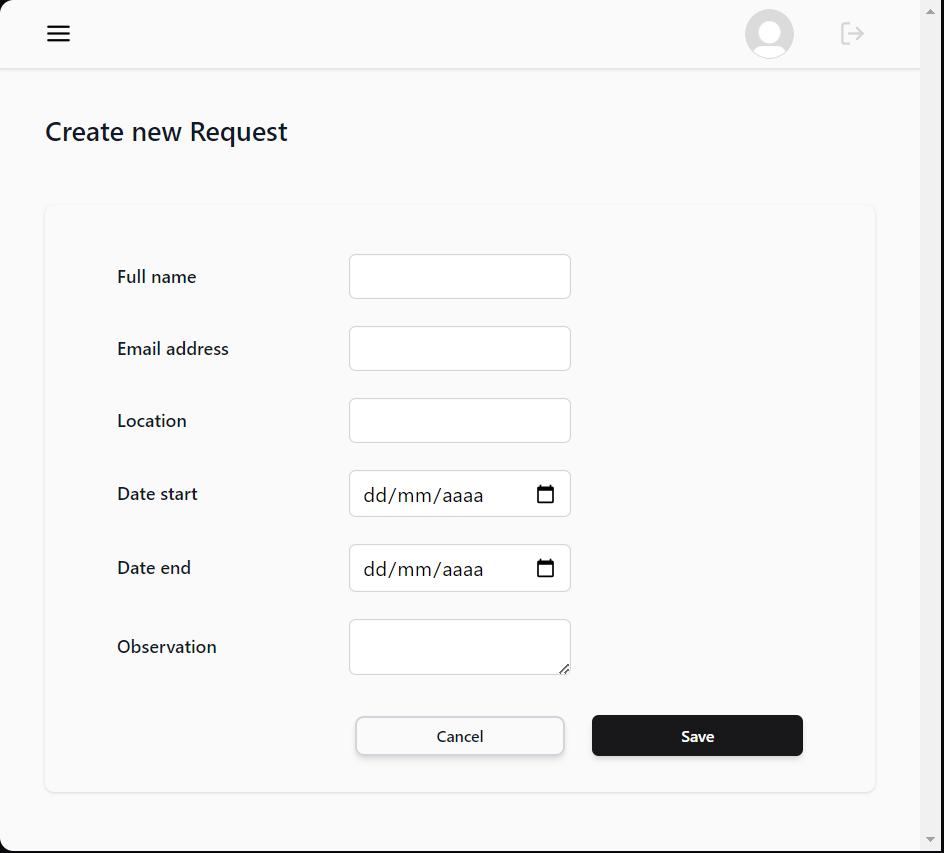

# Holiday Plan


**Holiday Plan** is a website that you can use to manage your company's vacation plan and provide information to employees about the status of their vacation requests.

## How to install:

This instructions allows you to configure and start the project in yourself

- Open your terminal in your pc or machine.
- Once you open the terminal, you will run this code in your terminal

```bash
npm install
```

once with the dependencies installed, you can run this command

```bash
npm run dev
```

This command will show you the port

```bash
http://localhost:5173/
```

just copy and paste in your browser or hold the ctrl key for windows or command for mac and click on the link it will read you directly to the application.

## How to use:

Once you have finished installing and configuring the environment, you will be directed to this screen:


You can choose to enter as an approver or employee.

### Approver

To enter as an approver, you must provide the email and password already defined as default for the account, as there is only one approver, follow the email and password already defined:

- email: boss@example.com
- password: boss1234

Manager, you will be able to deny or approve your employees' vacations by clicking on the view button on the card and clicking on the buttons that will appear in the current modal:


### Employee

Now to join as an employee, you can create an account and register for free and then log into your account, as it is an app that is for just one company, as soon as you enter your email and password, you will be directed to a single page for all employees.

As soon as you register, you can make a new vacation request, in the image below, which the manager can deny or approve.


Once the request is made, you will be directed to the main employees page and wait for the approver's response

## 🔨Tools

The stacks I used in this project were:

- JavaScript - Programming language
- React.Js - Framework
- Supabase - For Authentication and stored data
- Sass - Stylesheet

# 📌 Version

I used the Git for version control. To see the latest version, check out here https://github.com/maatheuus/VactionPlan/commits/master/

# 📄 License

This project is licensed under the MIT License.
